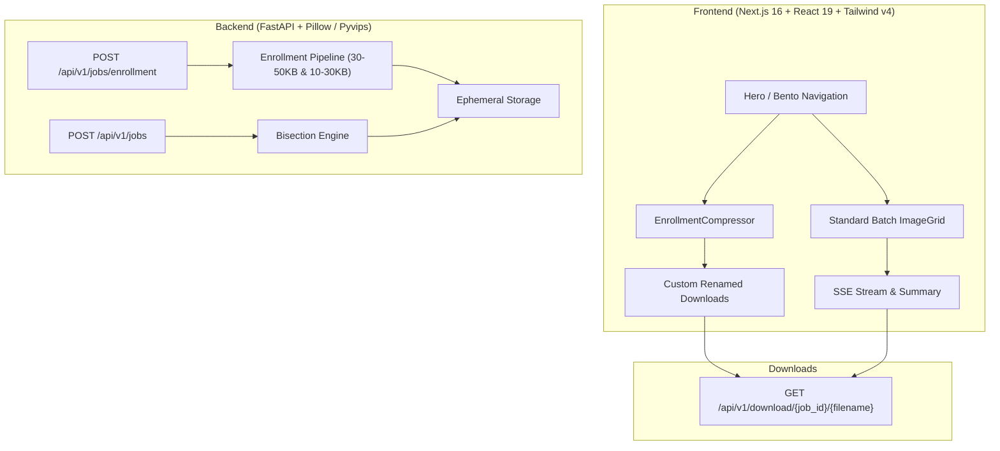

# EasyPress — Smart Image & Enrollment Compressor

A high-performance, mobile-first and desktop-optimized image compression engine with dedicated **Dual Photo & Signature Enrollment Compression (30–50KB Image / 10–30KB Sign)**, custom file renaming, and animated mesh background inspired by [diplomasathi.live](https://www.diplomasathi.live/).

---

## 🌟 Key Features

1. **Dual Photo & Signature Enrollment Compressor**:
   - **Simultaneous Uploads**: Dedicated slots for applicant Photo and Signature.
   - **Target Size Enforcement**:
     - 📸 **Photo**: Target range **30KB – 50KB**.
     - ✍️ **Signature**: Target range **10KB – 30KB**.
   - **Custom Renaming**: Mandatory base name prefix (e.g. `ravi` outputs `ravi_image.jpg` and `ravi_sign.jpg`).
   - **Universal Format Conversion**: Automatically converts any uploaded format (PNG, WebP, HEIC, TIFF, etc.) to standard JPG.
   - **Individual & Batch Downloads**: Separate 1-click downloads for Photo and Signature with pre-configured filenames.

2. **General Batch Compression Engine (10KB–50KB)**:
   - Built for government forms, visas, passports, and strict web performance budgets.
   - Dual-phase bisection algorithm: binary searches JPEG/WebP/PNG quality parameters, with adaptive resolution downsampling if quality floors are reached.

3. **Modern iOS Bento & Glassmorphism Aesthetic**:
   - Seamless responsive experience on both mobile devices and wide desktop monitors.
   - Ambient floating gradient mesh background and noise texture inspired by [diplomasathi.live](https://www.diplomasathi.live/).
   - Floating social dock in bottom-right corner connecting to [LinkedIn](https://www.linkedin.com/in/vishalsahu2002/) and [Instagram](https://instagram.com/dash_vishalsahu).
   - Centered minimalist developer attribution card.

4. **Ephemeral Storage & Privacy**:
   - Uploads stored in isolated UUID session folders and automatically purged after expiration.

---

## 🏗 Architecture



---

## 📁 Repository Structure

```
├── backend/
│   ├── app/
│   │   ├── api/v1/endpoints/
│   │   │   ├── jobs.py          # Upload, enrollment & SSE streaming
│   │   │   └── download.py      # File & ZIP downloads
│   │   ├── core/                # Configuration and CORS
│   │   ├── models/              # Pydantic schemas
│   │   ├── services/            # Bisection compression algorithms
│   │   └── main.py              # FastAPI application entrypoint
│   ├── requirements.txt
│   └── test_enrollment.py       # Automated unit & integration tests
├── frontend/
│   ├── src/
│   │   ├── app/
│   │   │   ├── layout.tsx       # Root layout with ambient mesh background
│   │   │   ├── page.tsx         # Bento dashboard & Enrollment view
│   │   │   └── globals.css      # Design system, animations & styling
│   │   └── components/          # Reusable UI widgets
│   ├── package.json
│   └── tsconfig.json
├── docker-compose.yml
├── nginx.conf
└── README.md
```

---

## 🚀 Getting Started

### Prerequisites
- Node.js 18+ and npm
- Python 3.10+

### Quick Start

#### 1. Backend

```bash
cd backend
python -m venv venv
venv\Scripts\activate   # On Windows (or source venv/bin/activate on Linux/macOS)
pip install -r requirements.txt
uvicorn app.main:app --reload --port 8000
```

#### 2. Frontend

```bash
cd frontend
npm install
npm run dev
```

Open [http://localhost:3000](http://localhost:3000) in your browser.

---

## 👨‍💻 Developer Attribution

**Developed by Vishal Sahu, CSE Student at Govt. Polytechnic Madhogarh.**

- 💼 **LinkedIn**: [vishalsahu2002](https://www.linkedin.com/in/vishalsahu2002/)
- 📷 **Instagram**: [@dash_vishalsahu](https://instagram.com/dash_vishalsahu)
- 🌐 **Personal Website**: [diplomasathi.live](https://www.diplomasathi.live/)

---

## 📜 License

MIT License. Designed with visual excellence and engineering precision.
